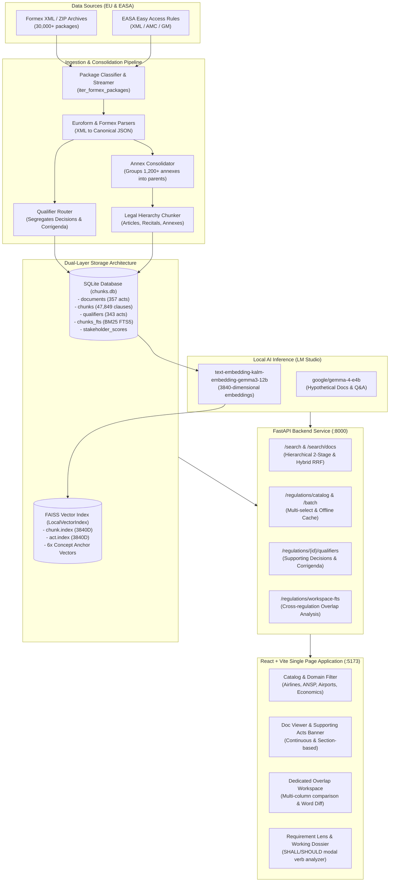

# 01. System Architecture Specification

## 1. Executive Overview

The **Regulation Assistant (AeroLex EU)** is an enterprise-grade regulatory intelligence platform designed specifically for European Union (EU) and European Union Aviation Safety Agency (EASA) aviation law. It ingests thousands of complex legal publication packages, unifies fragmented technical annexes, segregates non-regulatory administrative qualifiers (Decisions and Corrigenda), and powers high-precision hybrid retrieval (Dense Vector + BM25 Full-Text Search).

The system integrates local open-weights AI inference via **LM Studio** (`text-embedding-kalm-embedding-gemma3-12b-2511` producing 3,840-dimensional vectors) with SQLite FTS5, providing completely private, local, and auditable search and synthesis without requiring external cloud API dependencies.

---

## 2. High-Level Component Architecture

---

## 3. Core Architectural Tenets

### 3.1. Package-Level Ingestion vs. File-Level Clutter
Earlier ingestion pipelines processed every XML file in isolation, generating over 1,400 fragmented document records. Under that paradigm, technical annexes containing critical operational specifications (e.g. Part-CAT, Part-ORO) were stored as orphaned documents without titles, leaving user searches disconnected from parent acts.

The current architecture operates at the **Publication Package** level:
1. Identifies the primary regulation act (`.000101.xml` or `<ACT>`).
2. Gathers attached annexes (`.01004501.xml`, `<ANNEX>`) and nests them directly inside the parent regulation JSON.
3. Segregates administrative qualifiers (Commission Decisions and Corrigenda) into a dedicated relational table linked back to the target regulation.
4. Drops phantom master wrappers (`.doc.xml`, `.toc.xml`).

### 3.2. Dual-Layer Storage
- **Relational & Keyword Layer (SQLite)**: Stores clean legal document metadata, full markdown text, individual chunks, cross-document relations, and SQLite FTS5 indices for BM25 keyword matching.
- **Dense Vector Layer (FAISS `IndexFlatIP`)**: Stores normalized 3,840-dimensional vector embeddings for cosine similarity search. Partitioned into `CHUNK` (fine-grained clauses) and `ACT` (document-level scope).

### 3.3. Hierarchical Retrieval & Domain Anchors
Instead of flat chunk similarity, retrieval uses a 2-stage hierarchical score:
1. **Act-Level Prior**: The user query is matched against the 357 primary regulation scopes (`act.index`).
2. **Chunk-Level Search**: Chunks belonging to top-ranking regulations receive an Act Prior bonus:
   $$\text{Score} = (0.75 \times \text{ChunkScore}) + (0.25 \times \text{ParentActScore}) + \text{StakeholderBonus}$$
3. **Concept Anchor Domain Scoring**: All chunks and regulations are pre-scored against 6 stakeholder reference vectors (Airlines, ANSP, Airports, Economics, Maintenance, Flight Crew) using matrix multiplication in NumPy, enabling instant domain filtering and user persona boosting.

### 3.4. Offline-First Client Architecture
The frontend leverages browser **IndexedDB** (`idb-keyval`) to locally cache full regulation markdown documents. Once cached, users can run client-side text similarity, view word-by-word diffs, and inspect clauses without consuming backend bandwidth.
